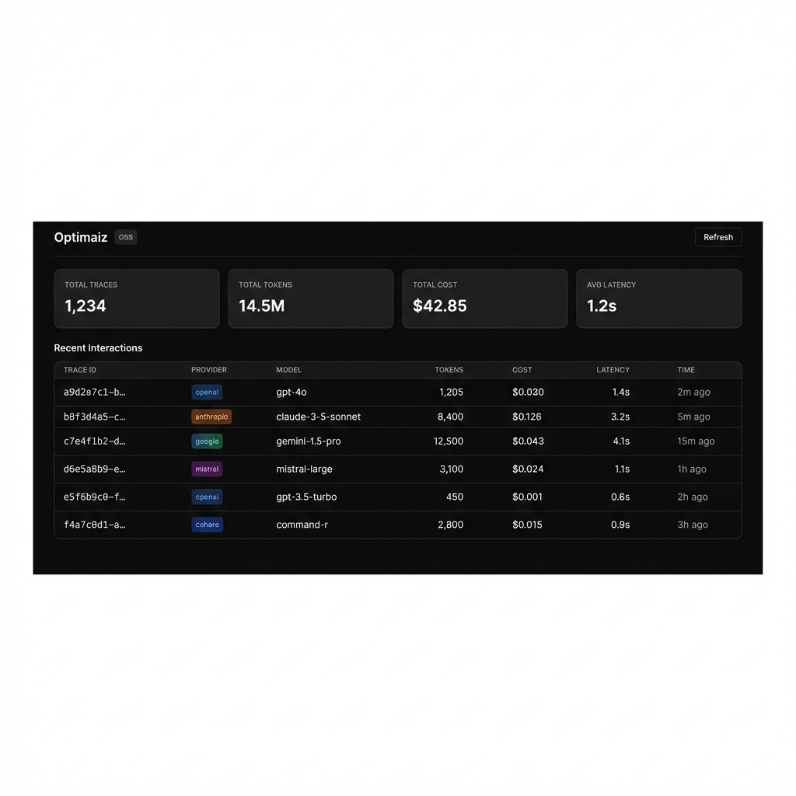
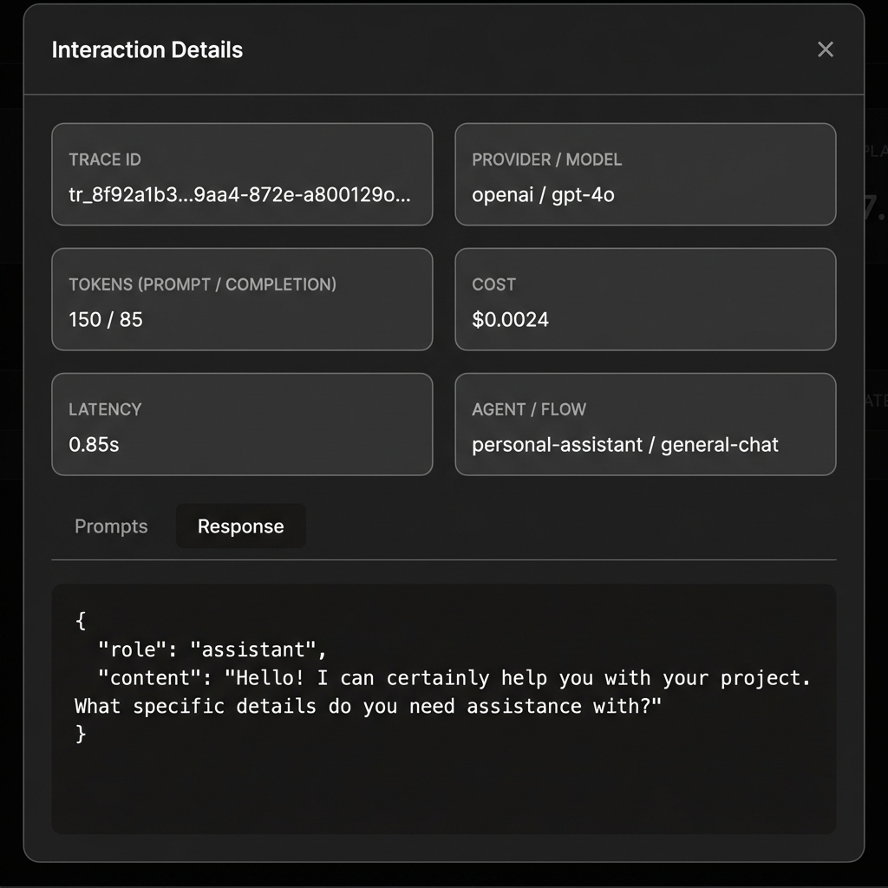

# Optimaiz

**Open-source LLM observability platform** - Track costs, latency, and usage across OpenAI, Anthropic, Gemini, and more.

**Open-source LLM observability platform** - Track costs, latency, and usage across OpenAI, Anthropic, Gemini, and more.

<p align="center">
  
  
</p>

[](LICENSE)
[](https://www.npmjs.com/package/@endlessriver/optimaiz)

## Features

- **Multi-Provider Support** - OpenAI, Anthropic, Google Gemini, Mistral, Cohere, Perplexity, and more
- **Cost Tracking** - Automatic cost calculation with up-to-date pricing
- **Latency Monitoring** - Track response times for optimization
- **Token Usage** - Monitor prompt and completion tokens
- **Tool/Function Calls** - Track tool executions with unified format
- **Self-Hosted** - Run locally with SQLite, no cloud required
- **Simple Dashboard** - View all your LLM interactions in one place

## Quick Start

### 1. Start the Server

```bash
# Using npx (recommended)
npx @optimaiz/server

# Or with Docker
docker run -p 3456:3456 -v optimaiz-data:/data optimaiz/server
```

Open http://localhost:3456 to see the dashboard.

### 2. Install the SDK

```bash
npm install @endlessriver/optimaiz
# or
pnpm add @endlessriver/optimaiz
```

### 3. Start Logging

```typescript
import { OptimaizClient } from '@endlessriver/optimaiz';
import OpenAI from 'openai';

const optimaiz = new OptimaizClient({
  token: 'any-token', // For local server, any token works
  baseUrl: 'http://localhost:3456',
});

const openai = new OpenAI();

// Wrap your LLM calls for automatic tracing
const { response, traceId } = await optimaiz.wrapLLMCall({
  provider: 'openai',
  model: 'gpt-4o-mini',
  promptTemplate: [
    { type: 'text', role: 'user', value: 'Hello {name}!' }
  ],
  promptVariables: { name: 'World' },
  call: () => openai.chat.completions.create({
    model: 'gpt-4o-mini',
    messages: [{ role: 'user', content: 'Hello World!' }],
  }),
});

console.log('Trace ID:', traceId);
```

## Packages

| Package | Description |
|---------|-------------|
| [@endlessriver/optimaiz](./packages/sdk) | Client SDK for instrumenting LLM calls |
| [@optimaiz/server](./packages/server) | Self-hosted server with dashboard |

## Architecture

```
┌─────────────────────────────────────────────────────────────────┐
│                        Your Application                         │
├─────────────────────────────────────────────────────────────────┤
│                       @endlessriver/optimaiz                             │
│   - wrapLLMCall()     - startTrace()     - appendResponse()     │
│   - Tool conversion   - Prompt templating                       │
└─────────────────────────────────────────────────────────────────┘
                              │
                              ▼
┌─────────────────────────────────────────────────────────────────┐
│                      @endlessriver/optimaiz                           │
├─────────────────────────────────────────────────────────────────┤
│  API Layer          │  Core              │  Dashboard           │
│  - /api/v1/*        │  - Parsers         │  - Interactions      │
│  - Express          │  - Cost estimator  │  - Analytics         │
│                     │  - Token extractor │                      │
├─────────────────────────────────────────────────────────────────┤
│                         SQLite                                  │
└─────────────────────────────────────────────────────────────────┘
```

## Supported Providers

| Provider | Models | Cost | Tokens | Tool Calls |
|----------|--------|------|--------|------------|
| OpenAI | GPT-5.2, GPT-4o, o1, o3, etc. | ✅ | ✅ | ✅ |
| Anthropic | Claude Opus 4.5, Sonnet, Haiku | ✅ | ✅ | ✅ |
| Google | Gemini 3, 2.5, Veo | ✅ | ✅ | ✅ |
| Mistral | Large, Small, Codestral | ✅ | ✅ | ✅ |
| Cohere | Command R, R+ | ✅ | ✅ | - |
| Perplexity | Sonar, Sonar Pro | ✅ | ✅ | ✅ |

## API Reference

### SDK Methods

```typescript
// Initialize client
const client = new OptimaizClient({ token, baseUrl });

// High-level wrapper (recommended)
client.wrapLLMCall({ provider, model, call: () => ... })

// Low-level methods
client.startTrace({ traceId, provider, model, promptTemplate, ... })
client.appendResponse({ traceId, rawResponse })
client.finalizeTrace(traceId)
client.logError(traceId, error)
client.sendFeedback(traceId, { rating, comment })

// Tool utilities
client.convertToolsToProvider(tools, 'openai')
client.convertToolsFromProvider(tools, 'anthropic')
client.validateTools(tools)
```

### Server API

```
POST /api/v1/interactions/start
POST /api/v1/interactions/append
POST /api/v1/interactions/finalize
POST /api/v1/interactions/error
POST /api/v1/interactions/feedback
POST /api/v1/interactions/tool-execution
POST /api/v1/interactions/tool-results
GET  /api/v1/interactions
GET  /api/v1/interactions/:traceId
GET  /api/v1/analytics
GET  /health
```

## Cloud Version

For advanced features like:
- Multi-user authentication
- Team collaboration
- Advanced analytics
- Agent versioning
- Compliance & PII detection
- Optimization recommendations

Check out [Optimaiz Cloud](https://optimaiz.io)

## Development

```bash
# Clone the repo
git clone https://github.com/optimaiz/optimaiz.git
cd optimaiz

# Install dependencies
pnpm install

# Build all packages
pnpm build

# Run server in development
pnpm dev
```

## Contributing

Contributions are welcome! Please read our [Contributing Guide](CONTRIBUTING.md) for details.

## License

MIT - see [LICENSE](LICENSE)
